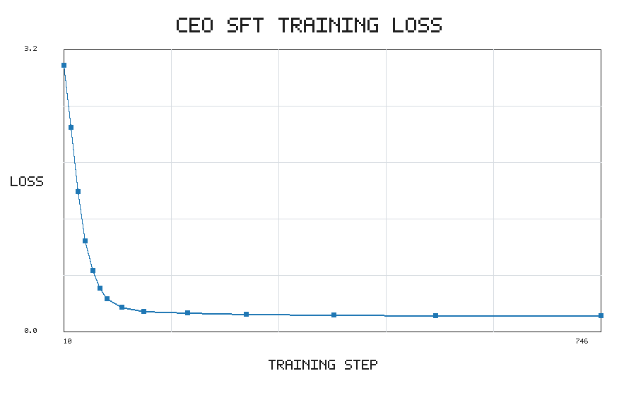
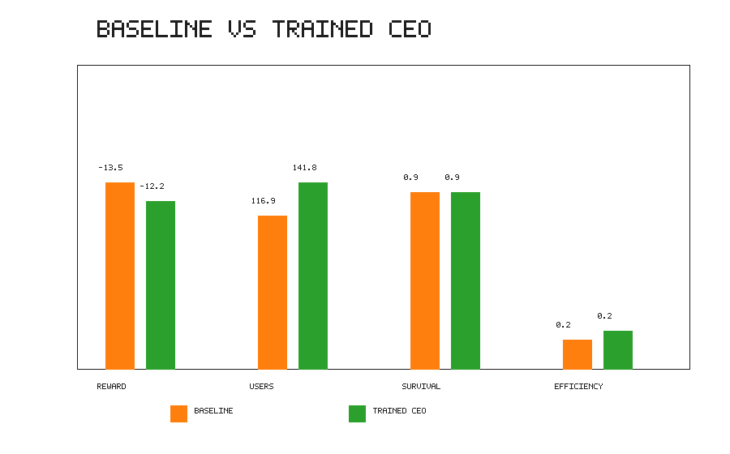

# Multi-Agent Startup Simulator (MASS)

`MASS` is a compact startup simulation environment where specialized agents make business decisions under uncertainty over multiple timesteps.

The current project includes:

- a shared startup environment with hidden market state
- partial observability and noisy signals
- delayed action consequences
- stochastic marketing outcomes and random external events
- heuristic Tech, Growth, Finance, and CEO agents
- prompt scaffolding and a trained-CEO inference path for LLM-driven control
- single-episode simulation, multi-episode evaluation, and trajectory collection scripts
- an OpenEnv-style package wrapper and manifest
- Hugging Face TRL SFT training script for the CEO policy

## Project Goal

The repo is a world-modeling environment for:

- multi-agent coordination
- long-horizon decision-making
- business-style tradeoffs between growth, product quality, and financial survival

The codebase is best understood as:

- a working simulation prototype
- a heuristic baseline
- an OpenEnv-compatible environment package
- a trajectory collection and CEO fine-tuning pipeline
- a trained CEO evaluation path for before/after comparison

## Theme Alignment

- **Multi-Agent Interactions:** Tech, Growth, and Finance co-founders propose competing actions; the CEO selects one final decision.
- **Long-Horizon Planning:** Each episode spans many timesteps with delayed effects, recurring costs, and consequences from earlier decisions.
- **World Modeling:** Agents operate with noisy observations while hidden market demand, competition, economic conditions, and random events affect outcomes.

## How The Simulation Works

At each step:

1. The environment exposes a noisy observation of the startup state.
2. Three co-founders propose actions:
   - Tech Co-founder
   - Growth Co-founder
   - Finance Co-founder
3. The CEO chooses one final action.
4. The environment applies:
   - delayed effects from previous actions
   - the chosen action
   - recurring startup dynamics
   - a possible random external event
5. The environment computes reward and returns the next observation.

The startup can succeed or fail based on product quality, user growth, cash runway, burn, market conditions, and random shocks.

## Main Files

- `environment.py`: core startup world, hidden state, delayed effects, events, rewards, termination.
- `agents.py`: heuristic co-founder policies and CEO decision logic.
- `simulate.py`: single-episode runner with CLI flags and optional saved summary.
- `evaluation.py`: multi-episode runner with aggregate metrics and export helpers.
- `llm_agents.py`: prompt builders, safe action parsing, and fallback-to-heuristic LLM scaffolding.
- `mass_startup_env/`: OpenEnv-style typed action, observation, state, environment, and server app.
- `openenv.yaml`: OpenEnv manifest.
- `openenv_wrapper.py`: minimal reset/step wrapper for direct training-style integrations.
- `train.py`: trajectory collection and SFT/preference dataset export.
- `train_ceo_sft.py`: Hugging Face TRL SFT script for the CEO policy.
- `Project_Overview.md`: original hackathon/product framing.
- `TEMP_IMPLEMENTATION_CHECKLIST.md`: temporary progress tracker.
- `TEMP_CODEBASE_GUIDE.md`: temporary deep codebase walkthrough for development and onboarding.

## Quick Start

Run a single episode:

```bash
python3 simulate.py
```

Run a short verbose simulation with hidden state debugging:

```bash
python3 simulate.py --horizon 10 --show-hidden-state
```

Use the full old-style trace when you want every reward component and full reasoning:

```bash
python3 simulate.py --horizon 10 --log-detail full
```

Save a single episode summary:

```bash
python3 simulate.py --quiet --save-summary outputs/single_episode.json
```

Run a baseline evaluation with report artifacts:

```bash
python3 evaluation.py --episodes 20 --horizon 30 --save-dir outputs/eval
```

Run trained CEO evaluation after placing a LoRA adapter at `outputs/models/ceo-sft`:

```bash
python3 evaluation.py --episodes 20 --horizon 30 --agent-mode trained_ceo --save-dir outputs/eval_trained
```

Collect trajectories for later training work:

```bash
python3 train.py --episodes 20 --horizon 30 --output outputs/trajectories.json
```

Export training-ready CEO decision datasets:

```bash
python3 train.py \
  --episodes 20 \
  --horizon 30 \
  --output outputs/trajectories.json \
  --sft-output outputs/ceo_sft.jsonl \
  --preference-output outputs/ceo_preferences.jsonl
```

Fine-tune the CEO with Hugging Face TRL:

```bash
python3 train_ceo_sft.py \
  --dataset outputs/ceo_sft.jsonl \
  --model Qwen/Qwen2.5-0.5B-Instruct \
  --output-dir outputs/models/ceo-sft \
  --epochs 2 \
  --batch-size 1 \
  --gradient-accumulation-steps 8
```

## Agent Modes

Three agent modes are currently supported in the simulation scripts:

- `heuristic`: uses the hand-written policies in `agents.py`
- `prompt_scaffold`: uses prompt-based wrappers from `llm_agents.py`, but still falls back safely because no real model backend is wired in by default
- `trained_ceo`: keeps heuristic co-founders and uses a trained Qwen LoRA CEO adapter with a safety gate

Example:

```bash
python3 simulate.py --agent-mode prompt_scaffold
```

```bash
python3 simulate.py --agent-mode trained_ceo
```

## Results

Final comparison over 20 episodes, horizon 30:

| Metric | Heuristic Baseline | Trained CEO + Safety Gate |
| --- | ---: | ---: |
| Average total reward | -13.52 | -12.212 |
| Average final users | 116.9 | 141.75 |
| Survival rate | 0.95 | 0.95 |
| Decision efficiency | 0.16 | 0.207 |






## Outputs

Typical generated outputs include:

- `outputs/single_episode.json`
- `outputs/trajectories.json`
- `outputs/ceo_sft.jsonl`
- `outputs/ceo_preferences.jsonl`
- `outputs/trajectories_prompt.json`
- `outputs/eval/evaluation_summary.json`
- `outputs/eval/episode_metrics.csv`
- `outputs/eval/step_metrics.csv`
- `outputs/eval/action_distribution.csv`
- `outputs/eval/baseline_report.md`
- `outputs/eval/reward_curve.svg`
- `outputs/eval/outcome_curve.svg`
- `outputs/eval/action_distribution.svg`
- `docs/assets/loss_curve.png`
- `docs/assets/reward_curve.png`
- `docs/assets/reward_comparison.png`

These are useful for inspecting step-by-step behavior and bootstrapping future training or evaluation work.

## Current State

What is implemented:

- startup environment with public and hidden state
- delayed effects queue
- random event system
- shaped company reward
- role-based heuristic decision flow
- single-episode simulation
- trajectory collection
- SFT and preference dataset export for CEO decision training
- TRL SFT script for CEO fine-tuning
- trained CEO model loading through `llm_agents.py`
- OpenEnv-style `reset`, `step`, and `state` wrapper package
- submission-ready PNG training/evaluation artifacts

What is not implemented yet:

- hosted Hugging Face Space URL
- public Colab notebook URL
- final video/blog URL
- polished interactive demo UI

## OpenEnv

The environment manifest is [openenv.yaml](openenv.yaml). The OpenEnv-style package is in `mass_startup_env/`.

Direct local smoke test:

```python
from mass_startup_env import StartupAction, StartupOpenEnv

env = StartupOpenEnv(max_days=3, seed=7)
obs = env.reset()
obs = env.step(StartupAction(action="invest_in_product"))
print(obs.reward, obs.done, env.state.step_count)
```

Server entrypoint:

```bash
python -m mass_startup_env.server.app
```

## Submission Links

Replace these placeholders before submitting:

- Hugging Face Space: TODO
- Colab notebook: TODO
- Code repository: TODO
- Video or blog: TODO

## Known Limitation

The Phase 2 evaluation flow now exports flat CSVs, a Markdown baseline report, and lightweight SVG plots without requiring plotting dependencies.

## If You Want To Understand The Codebase

Start with:

1. `README.md`
2. `simulate.py`
3. `agents.py`
4. `environment.py`

Then use `TEMP_CODEBASE_GUIDE.md` for the detailed file-by-file and function-by-function walkthrough.

## Next Good Improvements

- add tests for environment transitions and reward behavior
- make action costs and reward weights configurable
- improve disagreement quality between heuristic agents
- publish the Hugging Face Space
- add a short demo video or Hugging Face blog post
